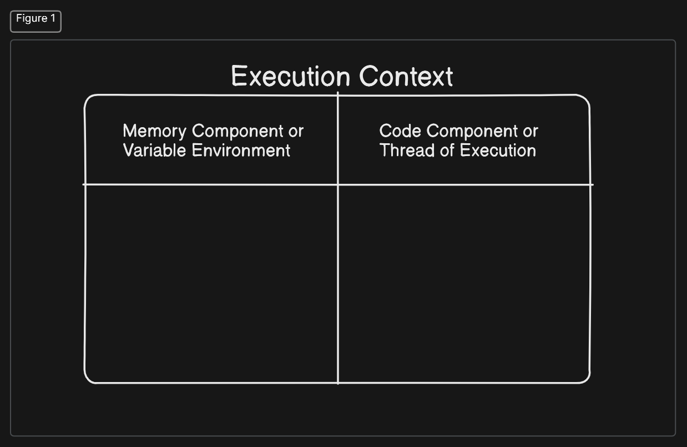
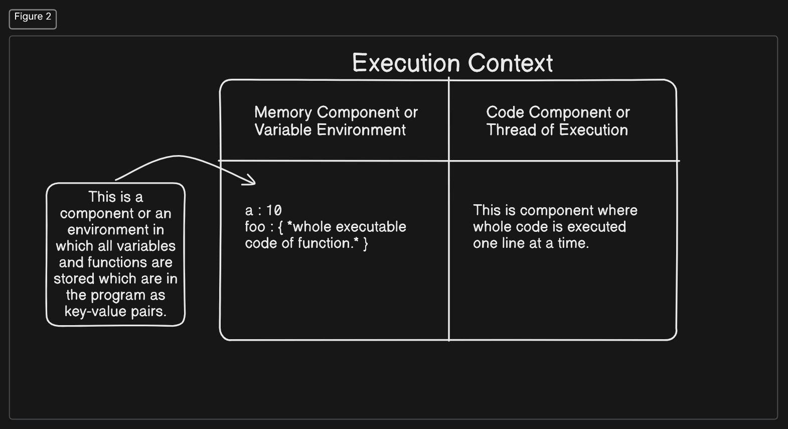

Ep01 | How JavaScript Works & Execution Context ?

Introduction:

I am writing this article so as I started learning Namaste JavaScript, (which I say you must check out) and I am creating notes via this article for the lecture through my prospective and what I have learned.
So, first of this all there are two important learning's of the episode 1 : 

   A. Everything in JavaScript happens inside an Execution Context.
   B. JavaScript is a Synchronous Single Threaded language.  

Now, let us discuss each one of them one by one.

1. Everything in JavaScript happens inside an Execution Context: 

Yes, it is true that Everything in JavaScript happens inside an Execution Context. But what is Execution Context ?, So you can consider Execution Context like a box inside which all the things are happening in JavaScript. 

The Execution Context consists of two parts : 

1. Memory Component or Variable Environment . 

2. Code Component or Thread of Execution. 

1. Memory Component or Variable Environment: 

This is a component or an environment in which all variables and functions are stored which are in the program as key-value pairs. like : 

Let a = 10 ;
const foo = () => {
// execution lines of function
};

are stored as : 

a : 10
foo : { *whole executable code of function.* }

2. Code Component or Thread of Execution: 

This is component where whole code is executed one line at a time. It is also known as Thread of Execution, which is smallest unit of programmed instructions given to a computer and can be managed independently.

2. JavaScript is Synchronous Single-Threaded language: 

This is one of the most important another fact about the JavaScript that it is Synchronous Single-Threaded language. Now we will each of the word Synchronous Single-Threaded. So, Single-Threaded means JavaScript will execute one command at a time, you can say one thread at that a time, while Synchronous means that it will execute command in specific order, in which it goes to next line once the current line has been finished executing. 

So, combining these we can say that JavaScript is Synchronous Single-Threaded language, which execute one line of code at a time in a specific order while going to next line only when the current line of the code has  been completely executed.

So, This is my first article. I hope you like that. If you have any doubts and suggestions, do let me know at:  https://linkedin.com/in/rahulkumarpahwa.

Also, I will create a repo for the Namaste JavaScript course I have started where I will post this article as readme. so do check out it at : https://github.com/rahulkumarpahwa

Singing off, 

Rahul Kumar.